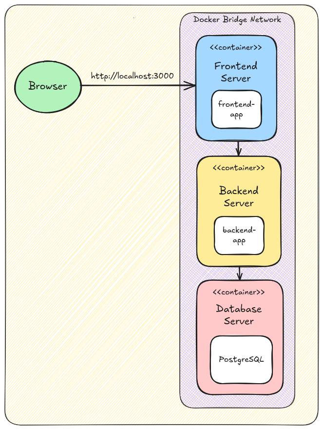

# Project 1: Poll System 🚀

A simple poll system to showcase my skills and knowledge with different technologies.

## Related Repositories

* [frontend-app](https://github.com/enmanuelrdgz/frontend-app)  
* [backend-app](https://github.com/enmanuelrdgz/backend-app)  

## Features 🌟

* JWT-based authentication
* Data persistence using PostgreSQL
* Deployment with Docker Compose

## Architecture

This system is composed of 3 Docker containers running on the same host, interconnected via a Docker Bridge Network  

* **Frontend Server**: This container hosts the frontend application, which is responsible for fetching poll data from the Backend Server and presenting it to users in an intuitive interface. When a user performs actions such as authentication or poll creation, the data is first sent to the Frontend Server, which then relays it to the Backend Server

* **Backend Server**: The Backend Server container houses the backend application, which handles the core business logic and performs CRUD operations on the database. It acts as the central hub for processing requests from the Frontend Server and managing data interactions with the Database Server.

* **Database Server**: This container hosts a PostgreSQL instance, acting as the primary "persistent" data storage for the system. However, this container is not configured with a volume mapped to your host machine. As a result, any data stored within the container will be lost when the container is stopped.

<div style="  text-align: center; padding: 10px;">

</div>

## Installation 📦

1. **Clone this repository**:  
    Start by cloning this repository to your local machine.

    ```bash
        git clone https://github.com/enmanuelrdgz/fullstack-poll-system.git
        cd fullstack-poll-system
    ```
2. **Run the installation script**:  
    Execute the **install.sh** script wich automates the setup process by performing the following tasks:
    * Downloads the source code for both the backend and frontend applications.
    * Uses the **docker-compose.yml** file to build and run Docker images for the backend, frontend, and database components.

     ```bash
        sudo sh install.sh
    ```